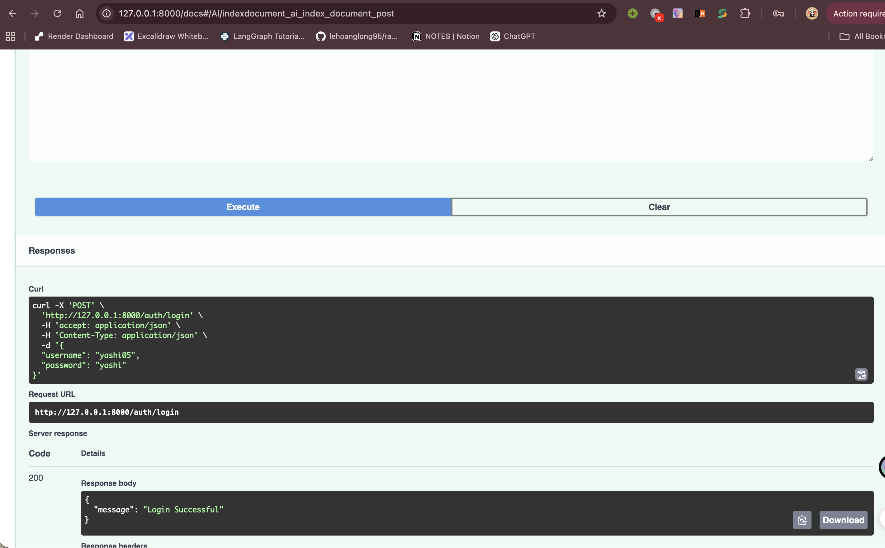
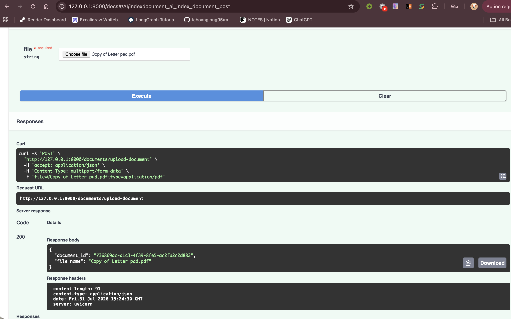
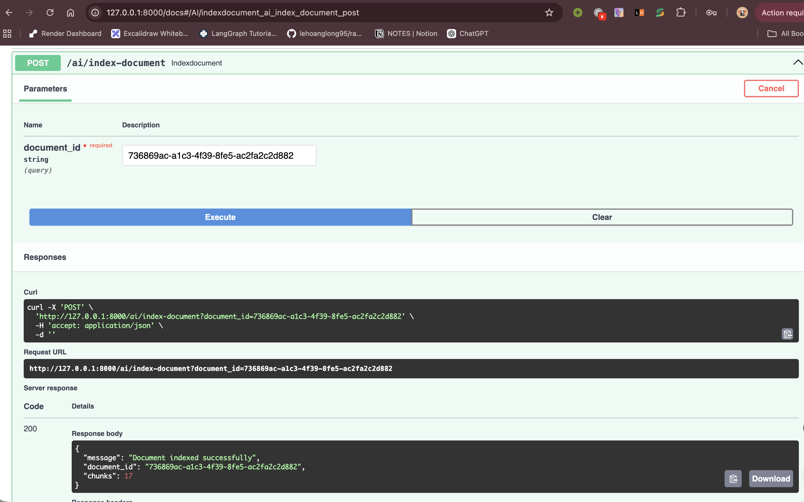
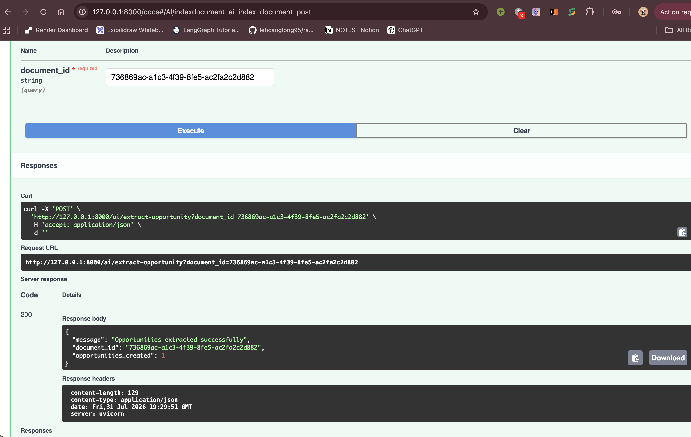
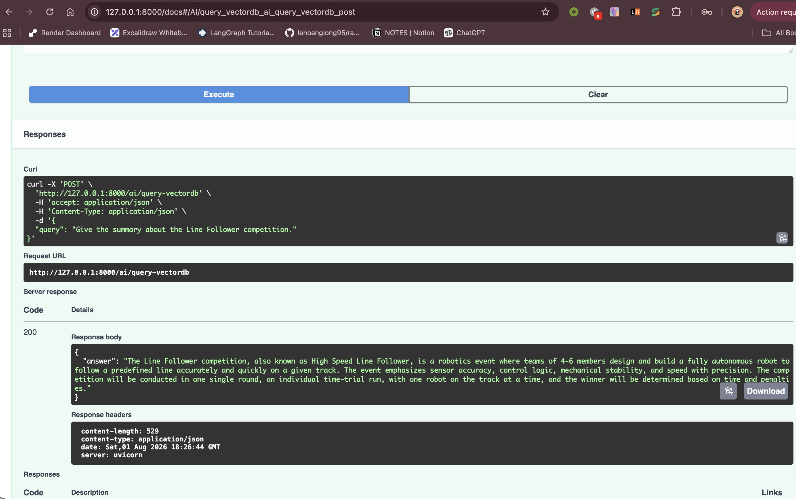

# Yashi Saini | AI-SAAS | Yashi-AISaaS-0703 | UDP_AI_SAAS

# Tick-It AI — Document Intelligence & Opportunity Tracker (Backend)

An AI-powered SaaS backend that turns uploaded PDFs (circulars, notices, brochures, competition rules, etc.) into structured, actionable data. It uses a Retrieval-Augmented Generation (RAG) pipeline to let users **chat with their documents** and automatically **extract opportunities** (internships, jobs, scholarships, hackathons, events...) along with their deadlines and follow-up tasks.

Built with **FastAPI**, **PostgreSQL**, **SQLAlchemy (async)**, **ChromaDB**, **LangChain**, and **Groq-hosted LLMs**.

---

## Screenshots


### user login

<p align="center">
  
</p>

### upload document

<p align="center">
  
</p>

### index document

<p align="center">
  
</p>

### extract opportunity

<p align="center">
  
</p>

### query vectordb

<p align="center">
  
</p>


---

## Overview

Tick-It AI is designed to solve a simple problem: important opportunities (internship calls, scholarship notices, hackathon rules, job postings) are usually buried inside dense PDFs, and it's easy to miss deadlines or requirements. This backend lets a user:

1. **Upload a document** (PDF).
2. **Index it** into a vector database for semantic search.
3. **Ask questions** about the document in natural language (RAG-based Q&A).
4. **Automatically extract opportunities** from the document — with title, category, priority, deadline, required documents, and a list of actionable tasks — ready to be tracked like a to-do list.

## Features

-  **JWT Authentication** — user registration and login with hashed passwords (Argon2 via `pwdlib`) and bearer-token protected routes.
-  **Document Ingestion** — PDF upload with SHA-256 deduplication (re-uploading the same file returns the existing record instead of storing a duplicate).
-  **Chunking Pipeline** — documents are parsed with PyMuPDF and split into overlapping chunks using LangChain's recursive text splitter.
-  **Embeddings & Vector Search** — chunks are embedded with `sentence-transformers` and stored in a persistent **ChromaDB** collection for similarity search.
-  **RAG-based Q&A** — ask natural-language questions about an uploaded document; the system retrieves the most relevant chunks and asks an LLM to answer strictly from that context (with "not found" fallback to avoid hallucination).
-  **Automatic Opportunity Extraction** — a sliding-window LLM pass scans the full document and pulls out every distinct opportunity as structured JSON, then merges overlapping detections.
-  **Auto-generated Task Lists** — each extracted opportunity comes with system-inferred action items (with title, description, priority, and due date) so users get a ready-made checklist.
-  **Priority Inference** — deadlines and urgency are used to automatically tag opportunities/tasks as High, Medium, or Low priority.
-  **Relational Data Model** — Users, Documents, Opportunities, and Tasks are related via SQLAlchemy ORM models with cascading deletes.
-  **Async Everything** — fully async FastAPI routes and SQLAlchemy sessions (via `asyncpg`) for non-blocking I/O.
-  **Schema Migrations** — Alembic is set up for versioned database migrations.

## Tech Stack

| Layer | Technology |
|---|---|
| API Framework | FastAPI (async), Uvicorn |
| Database | PostgreSQL, SQLAlchemy (async ORM), Alembic migrations |
| Auth | JWT (`pyjwt`), Argon2 password hashing (`pwdlib`) |
| Document Parsing | PyMuPDF via LangChain loaders |
| Chunking | LangChain `RecursiveCharacterTextSplitter` |
| Embeddings | `sentence-transformers` (`all-MiniLM-L6-v2`) |
| Vector Store | ChromaDB (persistent local collection) |
| LLM | Groq API (`llama-3.1-8b-instant` via `langchain-groq`)|
| Config | `python-dotenv` |
| Package Management | `uv` (with `pyproject.toml` / `uv.lock`), pip `requirements.txt` also provided |

## Architecture

```
Upload PDF ──▶ Ingestion (PyMuPDF + chunking)
                     │
                     ▼
            Embedding Pipeline (SentenceTransformers)
                     │
                     ▼
              ChromaDB Vector Store
                     │
        ┌────────────┴────────────┐
        ▼                         ▼
  RAG Query Endpoint      Opportunity Extraction
  (retrieve + answer)   (sliding window + LLM JSON
                          extraction + merge)
                                  │
                                  ▼
                     PostgreSQL: Opportunities + Tasks
```

The RAG pipeline is initialized once at application startup (`app.state.rag`) via FastAPI's `lifespan` context, so the embedding model and vector store connection are reused across requests.

## Project Structure

```
app/
├── ai/                  # Core AI/RAG building blocks
│   ├── embeddings.py    # SentenceTransformer embedding pipeline
│   ├── ingestion.py     # PDF loading + chunking
│   ├── llm.py           # Groq LLM client factory
│   ├── prompts.py       # Prompt templates (RAG answer, opportunity extraction)
│   ├── rag.py           # RagPipeline: query() and extract_window()
│   ├── retriever.py     # Vector similarity retrieval + sliding windows
│   └── vectorstore.py   # ChromaDB persistent client wrapper
├── core/
│   ├── config.py        # App configuration
│   └── security.py      # Password hashing, JWT creation/verification, auth dependency
├── db/
│   ├── base.py           # SQLAlchemy declarative base
│   └── session.py        # Async engine & session factory
├── models/                # SQLAlchemy ORM models
│   ├── users.py
│   ├── documents.py
│   ├── opportunities.py
│   └── tasks.py
├── routers/               # FastAPI route definitions
│   ├── auth.py            # /auth/register, /auth/login
│   ├── document.py        # /documents/upload-document
│   └── ai.py               # /ai/index-document, /ai/extract-opportunity, /ai/query-vectordb
├── schemas/               # Pydantic request/response models
├── services/              # Business logic layer
│   ├── auth.py
│   ├── document.py
│   ├── opportunities.py
│   └── rag_service.py
├── utils/ai.py            # Shared helpers (RAG pipeline init, result merging)
└── main.py                 # FastAPI app entry point & router registration

alembic/                    # Database migration environment
```


## Data Model

- **User** — `id, username, email, hashed_password, created_at, updated_at` → has many Documents and Opportunities.
- **Document** — `id, user_id, filename, file_path, file_type, file_hash (unique), uploaded_at` → has many Opportunities.
- **Opportunity** — `id, document_id, user_id, title, summary, description, category, priority, deadline, status, required_documents (JSONB)` → has many Tasks.
- **Task** — `id, opportunity_id, title, description, priority, completed, due_date`.

All primary keys are UUIDs; relationships cascade on delete.

## API Endpoints

| Method | Endpoint | Auth Required | Description |
|---|---|---|---|
| `POST` | `/auth/register` | No | Register a new user |
| `POST` | `/auth/login` | No | Log in (OAuth2 password flow) and receive a JWT access token |
| `POST` | `/documents/upload-document` | Yes | Upload a PDF; deduplicated by file hash |
| `POST` | `/ai/index-document` | Yes | Chunk, embed, and store a document's content in ChromaDB |
| `POST` | `/ai/extract-opportunity` | Yes | Run LLM extraction over an indexed document and persist opportunities + tasks |
| `POST` | `/ai/query-vectordb` | Yes | Ask a natural-language question; get an answer based on document context |

> Protected routes require a `Bearer <token>` obtained from `/auth/login`.

## Getting Started

### Prerequisites
- Python **3.14+**
- PostgreSQL instance
- A [Groq API key](https://console.groq.com/) (for the LLM)

### Installation

```bash
# Clone your fork
git clone https://github.com/<your-username>/UDP-AI-SAAS-PROJECT-REPO.git
cd UDP-AI-SAAS-PROJECT-REPO

# Using uv (recommended, matches pyproject.toml / uv.lock)
uv sync

# OR using pip
pip install -r requirements.txt
```

### Run the server

```bash
uvicorn app.main:app --reload
```

The API will be available at `http://127.0.0.1:8000`, with interactive docs at `http://127.0.0.1:8000/docs`.

## Environment Variables

Create a `.env` file in the project root:

```env
DATABASE_URL=postgresql+asyncpg://<user>:<password>@<host>:<port>/<db_name>
SECRET_KEY=your-secret-key
ALGORITHM=HS256
ACCESS_TOKEN_EXPIRE_MINUTES=15
GROQ_API_KEY=your-groq-api-key
```

## Running Database Migrations

```bash
alembic upgrade head
```

To generate a new migration after changing models:

```bash
alembic revision --autogenerate -m "description of change"
```

## Roadmap

Planned functionality:
- **Reminders** — Reminder on the basis of opporunities.
- **Task management endpoints** — CRUD operations on Tasks.
- **Opportunity listing/detail endpoints** — exposing the opportunities via read endpoints.

---
